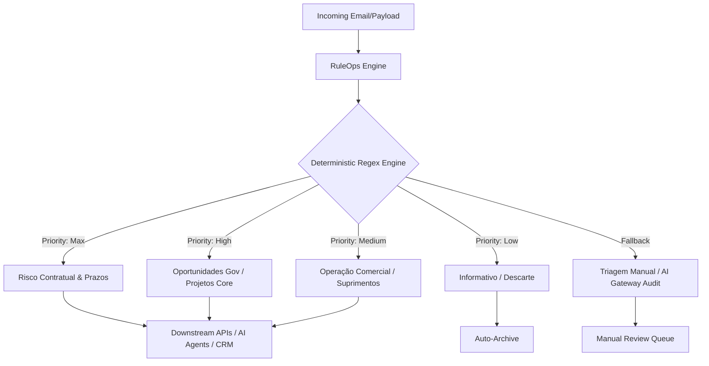

# Agnostic RuleOps Framework

An enterprise-grade, deterministic triage and routing engine designed as an intelligent gateway for email operations. 

> [!NOTE]
> This framework serves as a scalable, high-performance triage system. It operates deterministically using regex-based intent classification before routing payloads to downstream workflow automation, CRM tools, or AI Agents (MCP/LangGraph).

## Architecture Overview

The system is designed with an **Agnostic Architecture**. Although the current use case implementation is configured for a commercial CFTV, SCA, and B2G Government Contract operation, the core pipeline is completely decoupled. By simply replacing the regex patterns and target dictionary values in the rules engine, this engine can be adapted to any domain (e.g., healthcare, logistics, customer support).



## Features

- **Fail-Fast Evaluation**: High-priority risks (e.g., contractual delays, government notices) are evaluated at the top of the decision tree to ensure near-zero latency for critical paths.
- **Accurate Regular Expressions**: Safe patterns (like `[cç][aã]o`) prevent misspelling discrepancies from causing triage routing failures.
- **Structured Dict Serialization**: Returns clean `Dict[str, str]` outputs (JSON-like structure) natively ready for downstream integrations like ServiceNow, Salesforce CRM, or LLM-based Tool Calling.

## Executive Triage & Automation Matrix

| Category | Priority | Triggers (Subject / Body) | Route Target | Action Workflow |
| :--- | :--- | :--- | :--- | :--- |
| **Risco Contratual e Prazos** | MÁXIMA | `notificação de atraso`, `prorrogação de prazo`, `cronograma`, `ofício` | Engenharia / Gestão de Contas | Mitigate financial risk and coordinate executive response. |
| **Oportunidades Gov.** | ALTA - CRÍTICO | `cotação eletrônica`, `dispensa de licitação`, `comprasnet`, `14.133` | Comercial / Licitações | Analyze bidding window, prepare bid document, and track dispute. |
| **Licitações Estatais** | ALTA - CRÍTICO | `licitação eletrônica aberta`, `copasa`, `envio de propostas` | Comercial / Licitações | Fetch bidding document (Edital) and run feasibility study. |
| **Pesquisa de Preços Judiciária**| ALTA - CRÍTICO | `pesquisa de preços`, `prorrogação da vigência`, `tst`, `solicitação de orçamento` | Comercial / Gestão de Contas | Prepare signed commercial proposal including taxes. |
| **Projetos Técnicos (Core)** | ALTA | `cftv`, `sca`, `câmeras`, `controle de acesso`, `vídeomonitoramento` | Engenharia / Pré-Vendas | Technical requirements analysis, item quantification, and design validation. |
| **Gestão de Contratos e CREA** | ALTA - TRAVA FATURAMENTO | `art`, `crea`, `pendente de aprovação`, `apostilamento`, `aditivo` | Licitações e Contratos / Engenharia | Resolve pending certifications/ARTs to unblock billing. |
| **Assinaturas Externas Gov.** | ALTA | `assinatura externa`, `disponibilizada para a assinatura` | Diretoria / Administrativo | Notify board to run digital signature on government portal (e.g., SEI). |
| **Cotações e Contratos** | ALTA | `cotação de preço`, `contratos`, `aditivos` | Gestão de Contas | Flag as 'New' and route to Account Management. |
| **Fornecimento e Faturamento** | MÉDIA | `faturamento`, `faturar`, `cnpj`, `cadastro` | Compras / Financeiro | Cross-reference tax details and execute procurement. |
| **Fornecedores Técnicos** | MÉDIA | `invenzi`, `intelbras`, `dahua` | Engenharia / Suprimentos | Analyze vendor documentation and hardware pricing sheets. |
| **Pipeline Comercial e CRM** | MÉDIA | `oportunidades de licitação`, `status atual`, `crm` | Comercial / Gestão de Contas | Synchronize statuses with pipeline tracking systems. |
| **Conselhos e Protocolos** | MÉDIA | `conselho regional`, `crt`, `baixa de registro`, `sinceti` | Suporte Técnico / Administrativo | Audit external council status and portal credentials. |
| **Informativo / Descarte** | BAIXA | `sigeo`, `documentos fiscais devolvidos` | Nenhuma | Auto-archive quietly. |

## Project Structure

```
Email-RuleOps/
├── data/              # Classification history and local databases
├── src/
│   ├── core/          # Rules engine logic and configs
│   │   ├── config.py  # Environment loader and fail-fast validation
│   │   └── rules.py   # Main RuleOps regex engine mapping
│   ├── models/        # Strict typings and schema structures (Future Pydantic models)
│   └── services/      # IMAP, SMTP, and system connection services
├── .editorconfig
├── .env
├── .gitignore
└── requirements.txt
```

## Running & Setup

1. Copy `.env.example` to `.env` and fill in your credentials.
2. Install requirements:
   ```bash
   pip install -r requirements.txt
   ```
